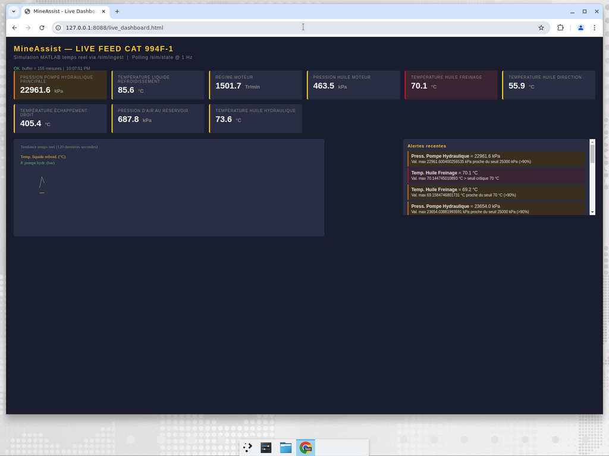
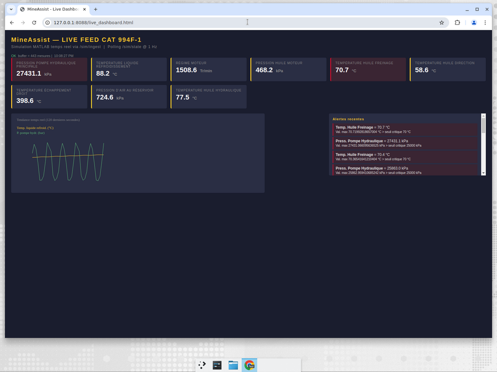
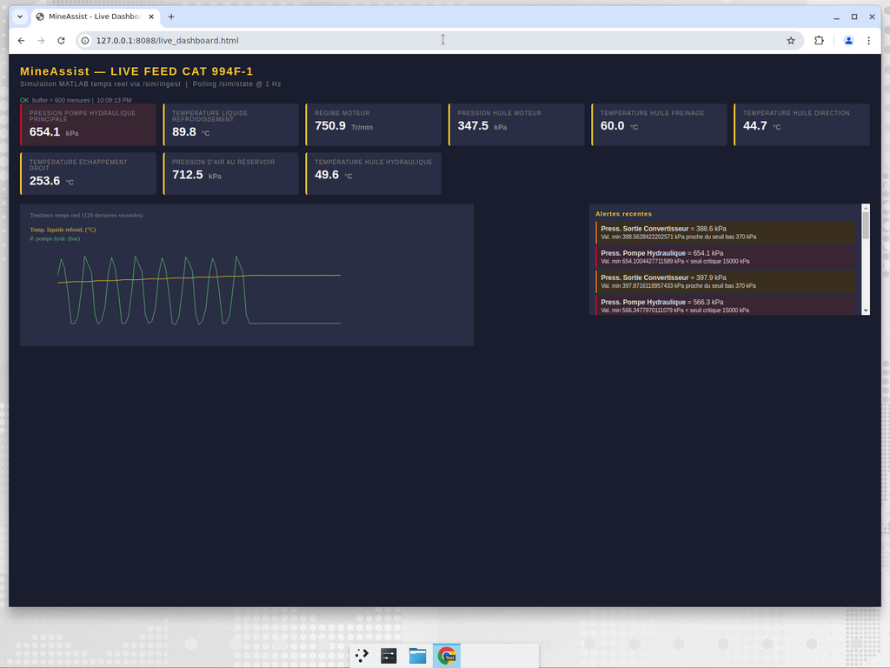

# Bridge temps réel **MATLAB → MineAssist**

Permet à la simulation MATLAB du 994F d'envoyer en temps réel des valeurs
capteurs (à 1 Hz) au backend MineAssist, qui :
1. Stocke un buffer (30 min glissantes) consultable par le frontend.
2. Détecte les alertes via `alert_detector.analyser_batch` (logique existante).
3. Déclenche les notifications e-mail / WhatsApp via le service existant.

## 1. Fichiers

| Fichier | Rôle |
|---|---|
| `sim_router.py` | router FastAPI **à déposer dans `app/app/`** |
| `mineassist_live_simulator.py` | simulateur Python (équivalent autonome) |
| `live_capteurs_to_mineassist.m` | bridge MATLAB (R2024) |
| `live_dashboard.html` | mini-dashboard temps réel pour démo |

## 2. Intégration dans le backend (1 ligne)

Copier `sim_router.py` dans `backend/app/app/sim_router.py`, puis dans `app/api.py` :

```python
# en haut, avec les autres imports
from app.sim_router import sim_router

# juste après les autres include_router
app.include_router(sim_router)
```

Aucun autre changement nécessaire. Endpoints exposés :

| Méthode | URL | Description |
|---|---|---|
| `POST` | `/sim/ingest` | Ingestion d'une snapshot capteurs (1 → N paramètres) |
| `GET`  | `/sim/state?n=60` | Buffer des n dernières snapshots + alertes récentes |
| `GET`  | `/sim/last-values` | Dernière snapshot uniquement (format dashboard) |
| `DELETE` | `/sim/buffer` | Réinitialise le buffer |

## 3. Lancement bout-en-bout

**Terminal 1 — Backend MineAssist** (votre installation habituelle)
```bash
cd backend
uvicorn app.api:app --host 0.0.0.0 --port 8000 --reload
```

**Terminal 2 — Frontend React** (idem)
```bash
cd frontend
npm run dev
```

**Terminal 3 — Simulateur Python** (1 Hz, durée 30 min)
```bash
cd matlab_simulation/realtime_bridge
python3 mineassist_live_simulator.py
```

ou en MATLAB (R2024) :
```matlab
>> addpath('etape1_hydraulique','etape2_thermique','realtime_bridge')
>> live_capteurs_to_mineassist
```

**Démo accélérée 8x avec injection de défaut**
```bash
python3 mineassist_live_simulator.py --speed 8 --fault ventilo_hs --t-fault 60 --duration 600
python3 mineassist_live_simulator.py --speed 8 --fault fuite_hydraulique --t-fault 30 --duration 300
python3 mineassist_live_simulator.py --speed 8 --fault radiateur_encrasse --t-fault 60 --duration 600
python3 mineassist_live_simulator.py --speed 8 --fault niveau_bas --t-fault 60 --duration 600
```

## 4. Mapping capteurs simulation → MineAssist

| Modèle MATLAB | Nom envoyé au backend (= `capteur_thresholds.py`) | Unité | Seuil |
|---|---|---|---|
| `p_pompe / 1000` | `CH994.P1.Pression pompe hydraulique principale` | kPa | 15000–25000 |
| `derived.p_huile_moteur` | `CH994.P1.Pression huile moteur` | kPa | min 275 |
| `derived.p_air` | `CH994.P2.Pression d'air au réservoir` | kPa | 600–900 |
| `derived.p_sortie_conv` | `CH994.P1.Pression sortie convertisseur` | kPa | 370–570 |
| `T_coolant` | `CH994.P1.Température liquide refroidissement` | °C | max 107 |
| `derived.T_huile_dir` | `CH994.P1.Température huile direction` | °C | max 70 |
| `derived.T_huile_frein` | `CH994.P1.Température huile freinage` | °C | max 70 |
| `derived.T_huile_hyd` | `CH994.P1.Température huile hydraulique` | °C | max 93 |
| `derived.T_PTO_avant` | `CH994.P1.Température PTO avant` | °C | max 93 |
| `derived.T_ech_d/g` | `CH994.P1.Température échappement Droit/gauche` | °C | max 600 |
| `derived.T_sortie_conv` | `CH994.P1.Température sortie convertisseur` | °C | max 129 |
| `derived.T_essieu_av/ar` | `CH994.P2.Température essieux avant/arrière` | °C | max 120 |
| `regime_moteur(t) + bruit` | `CH994.P2.Régime moteur` | Tr/min | max 1750 |

> **Important :** les noms incluent les accents (é, è, °) car le backend
> compare exactement aux clés de `CAPTEUR_THRESHOLDS`.

## 5. Format de la requête

```json
POST /sim/ingest
{
  "engin": "994F1",
  "horodatage": "2026-05-01T08:23:14",
  "cycle_phase": "levage",
  "defaut_actif": "ventilo_hs",
  "mesures": [
    {"parametre":"CH994.P1.Pression pompe hydraulique principale", "valeur":21340.5, "unite":"kPa"},
    {"parametre":"CH994.P1.Température liquide refroidissement", "valeur":89.8, "unite":"°C"},
    {"parametre":"CH994.P2.Régime moteur", "valeur":1502.7, "unite":"Tr/min"}
  ]
}
```

Réponse :
```json
{
  "status": "ok",
  "received_at": "...",
  "buffer_size": 443,
  "nb_alertes": 1,
  "alertes": [
    {"label":"Press. Pompe Hydraulique","valeur":21340.5,"unite":"kPa",
     "seuil":25000,"niveau":"Attention",
     "motif":"Val. max 21340.5 kPa proche du seuil 25000 kPa (>90%)",...}
  ]
}
```

## 6. Validation effectuée (sur ce backend de test)

Tests réalisés avec un backend FastAPI minimal contenant
`alert_detector.py` + `notification_service.py` + `sim_router.py` :

- **t = 60 s, état normal** : 9 capteurs verts, aucune alerte critique.
  

- **t = 180 s, défaut `ventilo_hs` actif depuis t=60s** : Press. Pompe et
  Temp. Huile Freinage en attention/alerte, T° eau commence à monter.
  

- **t = 600 s, fin de simulation** : 1139 alertes générées au total,
  T° liquide à 89,8 °C (non encore au seuil 107, mais l'évolution est
  visible sur la courbe orange du graphique).
  

## 7. Prochaines étapes (optionnel)

- **Frontend MineAssist** : ajouter une page `/live` qui affiche `/sim/state`
  via `useApiFetch` (rafraîchissement 1 s) — compatible avec le dashboard
  GMAO existant car le format `latest_by_param` est identique.
- **Étape 5 — Simulink** : reprendre `parametres_hydraulique.m` et
  `parametres_thermique.m` dans des blocs Simulink (Simscape Fluids /
  Thermal Liquid) pour le rapport.
